# Plan de Despliegue AROS PACS — AWS con Terraform (Modo Dev)

## Contexto y Decisiones de Diseño

Basado en los requerimientos del proyecto, el despliegue inicial se adaptará de la siguiente manera:
1. **Entorno Inicial:** Solo `dev`.
2. **Acceso:** Solo mediante IPs públicas y URLs generadas de AWS (sin dominio personalizado ni certificados ACM por el momento).
3. **Facturación y Aislamiento (AWS Organizations):** Para separar costos, utilizaremos una arquitectura Multi-Cuenta. 
   - **Cuenta AROS (Management/Core):** Paga y aloja el `core-api`, el `patient-portal`, el `physician-portal`, dicom-viewer y la BD central.
   - **Cuenta Clínica (Member Account):** Cada clínica tendrá su propia cuenta de AWS dedicada (creada via AWS Organizations). Aquí vivirá el `clinic-api`, `orthanc`, el `clinic-portal`, y su propia BD local. La clínica asume directamente los costos de esta cuenta.

---

## Arquitectura de Red Multi-Cuenta

```mermaid
graph TB
    subgraph Internet
        Users["Usuarios (Pacientes, Doctores, Clínicas)"]
    end

    subgraph "AWS Account - AROS (Core)"
        subgraph CloudFront_AROS["CloudFront (S3 OAI)"]
            CF_Patient["URL: Patient Portal"]
            CF_Physician["URL: Physician Portal"]
        end

        subgraph VPC_Core["VPC Core (10.0.0.0/16)"]
            ALB_Core["ALB Público (core-api)"]
            ECS_Core["ECS Fargate: core-api & sync_pacs"]
            RDS_Core["RDS PostgreSQL 16"]
            Redis_Core["ElastiCache Redis 7"]
        end

        S3_Media["S3: aros-media-dev"]
        SM_Core["Secrets Manager: RS256"]
    end

    subgraph "AWS Account - Clínica X (Member)"
        subgraph CloudFront_Clinic["CloudFront (S3 OAI)"]
            CF_Clinic["URL: Clinic Portal"]
        end

        subgraph VPC_Clinic["VPC Clínica (10.1.0.0/16)"]
            ALB_Clinic["ALB Privado (clinic-api)"]
            ECS_Clinic["ECS Fargate: clinic-api"]
            ECS_Orthanc["ECS Fargate: Orthanc"]
            RDS_Clinic["RDS PostgreSQL 15"]
        end
    end

    Users --> CF_Patient
    Users --> CF_Physician
    Users --> CF_Clinic
    Users --> ALB_Core
    
    ECS_Core --> RDS_Core
    ECS_Core --> Redis_Core
    ECS_Core --> S3_Media
    ECS_Core <-->|"VPC Peering Inter-Cuenta"| ALB_Clinic
    
    ECS_Clinic --> RDS_Clinic
    ECS_Clinic --> ECS_Orthanc
```



---

## Estructura de Terraform (Multi-Cuenta)

Organizaremos el código para soportar el despliegue en múltiples cuentas usando diferentes AWS Providers (asumiendo roles en las cuentas miembro).

```
infra/
├── environments/
│   └── dev/
│       ├── main.tf              # Define providers (AROS y Clínica) y llama módulos
│       ├── terraform.tfvars
│       └── backend.tf
├── modules/
│   ├── account_aros/            # Módulo raíz para la cuenta de AROS
│   │   ├── networking/
│   │   ├── ecs_core/
│   │   ├── rds_core/
│   │   └── s3_media/
│   ├── account_clinic/          # Módulo raíz instanciable N veces por clínica
│   │   ├── networking/
│   │   ├── ecs_clinic/
│   │   ├── orthanc/
│   │   └── rds_clinic/
│   └── peering/                 # Módulo para configurar el VPC Peering entre cuentas
```

---

## Fases de Implementación

### Fase 1: Foundation y Multi-Cuenta (AWS Organizations)
- Creación de la cuenta miembro para la clínica vía AWS Organizations.
- Configuración de roles IAM para permitir que Terraform asuma el rol `OrganizationAccountAccessRole` y despliegue en la cuenta de la clínica desde la cuenta principal de AROS.
- Despliegue de VPC Core (`10.0.0.0/16`) en Cuenta AROS.
- Despliegue de VPC Clínica (`10.1.0.0/16`) en Cuenta Clínica.
- Configuración de VPC Peering inter-cuenta y tablas de ruteo.

### Fase 2: Almacenamiento y Base de Datos (Dev)
- **Cuenta AROS:**
  - RDS PostgreSQL (`db.t3.micro`, single-AZ).
  - ElastiCache Redis (`cache.t3.micro`, single-node).
  - Buckets S3 para almacenamiento de media y assets estáticos de portales (Patient/Physician).
- **Cuenta Clínica:**
  - RDS PostgreSQL (`db.t3.micro`, single-AZ).
  - Bucket S3 para activos estáticos del portal (Clinic).

### Fase 3: Seguridad Base (WAF, Secrets & KMS)
- **Cuenta AROS:**
  - AWS Secrets Manager para credenciales de base de datos y llaves RS256 para JWT.
  - AWS KMS para cifrado básico y cifrado de PDFs.
  - **AWS WAF (Web Application Firewall):** Asignado al ALB público para proveer protección contra bots (AWS WAF Captcha) en los endpoints de registro `/api/v1/auth/register/*`.
- **Cuenta Clínica:**
  - Secrets Manager local (si aplica) para su base de datos.
- Las integraciones en el frontend dependerán del acceso directo vía HTTP a las IPs de los Application Load Balancers o a través de los subdominios estándar generados por CloudFront, ya que no se implementarán dominios personalizados en esta fase de dev.

### Fase 4: Servicios Base (Correo y Notificaciones)
- **Amazon SES (Simple Email Service):** 
  - Configuración en la Cuenta AROS para el envío transaccional de correos (Verificación de cuentas, Bienvenidas, Notificación de Reportes).
  - Al no usar dominio propio en dev, los correos remitentes (`arosPacs@gmail.com` o similar) deberán ser verificados manualmente en la consola de SES o sacados del "sandbox mode".

### Fase 5: ECS y Load Balancers
- **Cuenta AROS:**
  - Application Load Balancer Público para `core-api`.
  - Cluster ECS sobre Fargate para ejecutar `core-api` y el worker en background `sync_pacs`.
- **Cuenta Clínica:**
  - Application Load Balancer Privado interno (accesible solo a través del VPC Peering) para `clinic-api`.
  - Cluster ECS sobre Fargate para ejecutar `clinic-api` y el servidor `orthanc`.

### Fase 6: CDN y Frontends
- CloudFront distribuyendo los buckets S3 que contienen las Single Page Applications (SPAs).
- El acceso se hará a través de las URLs proporcionadas por AWS (ej. `d111111abcdef8.cloudfront.net`) o el endpoint DNS del ALB público de la API.

### Fase 7: Parametrización en Código
- Reemplazar las URLs y puertos harcodeados en el código por las variables de entorno inyectadas dinámicamente por Terraform durante la construcción del CI/CD (ej. la IP interna del ALB privado de la clínica y la URL dinámica de `core-api`).
- Configurar el backend Django para utilizar las credenciales SMTP proporcionadas por AWS SES.
